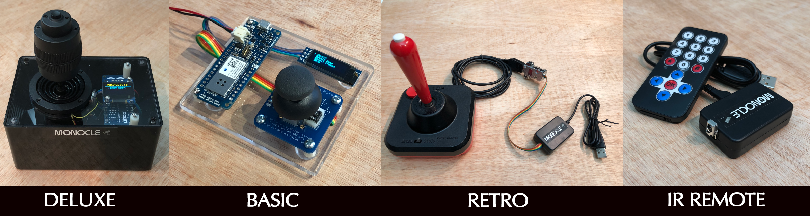
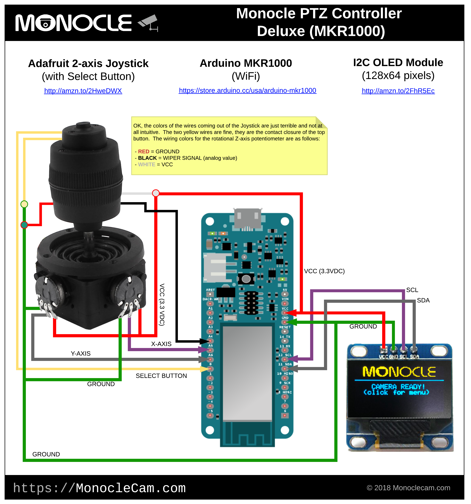
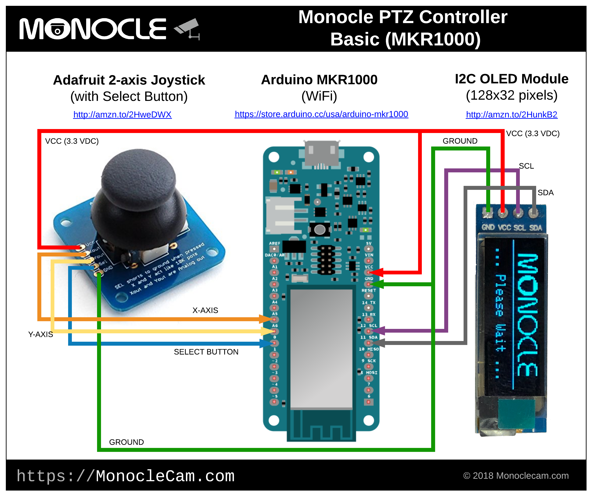
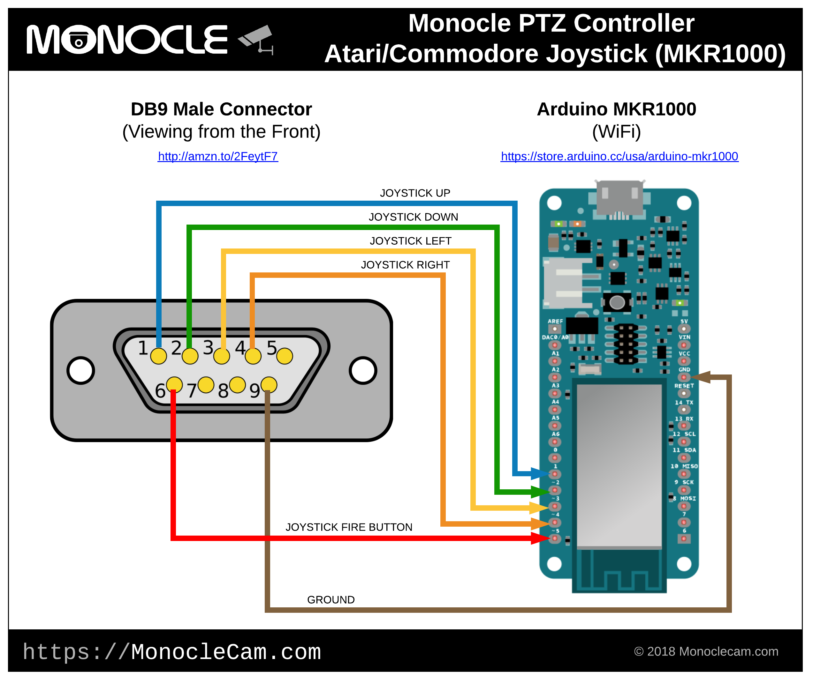
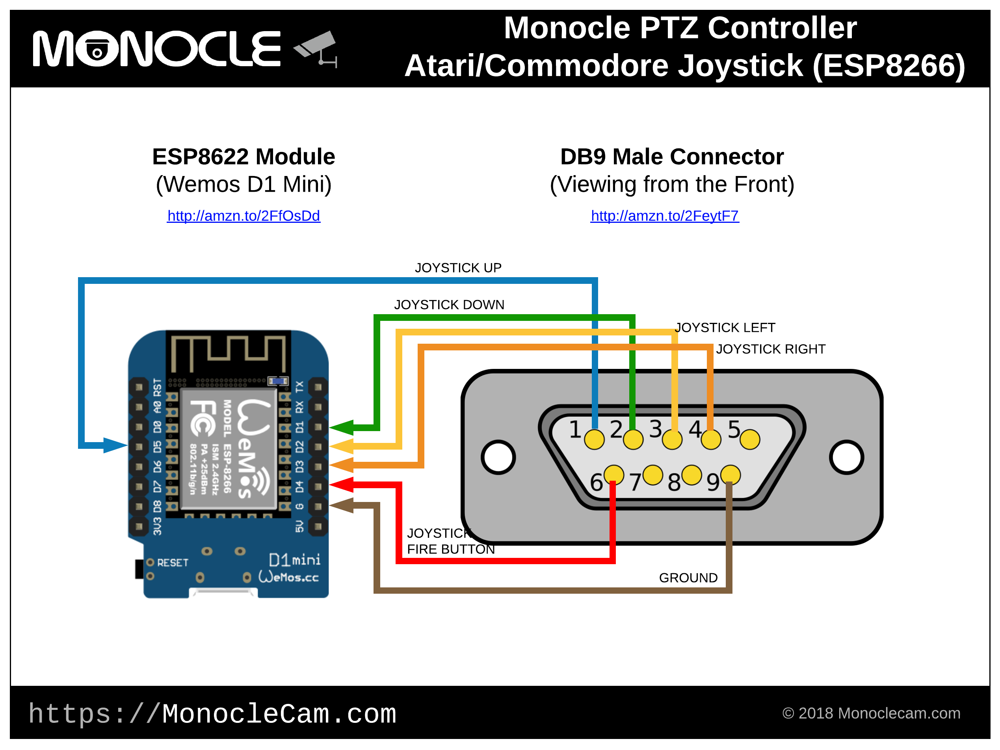
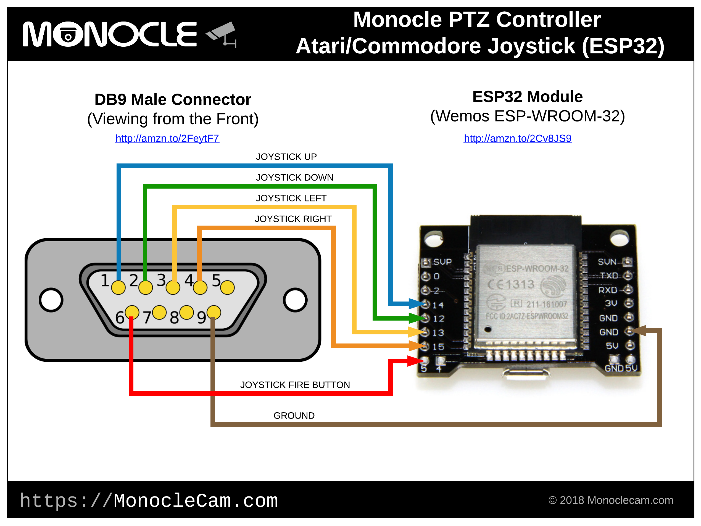
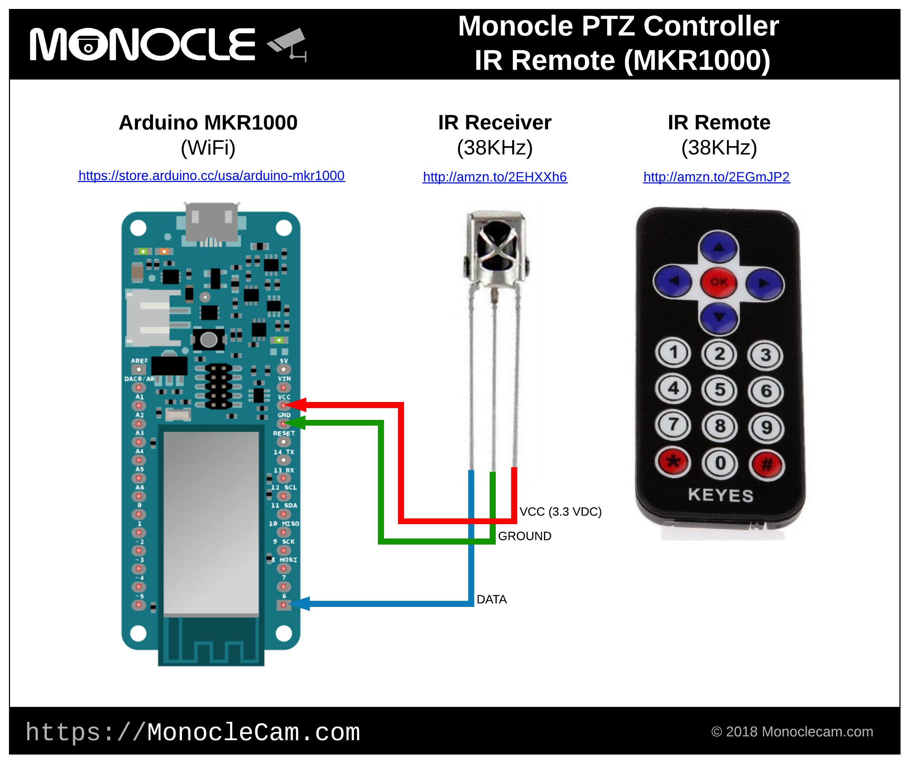
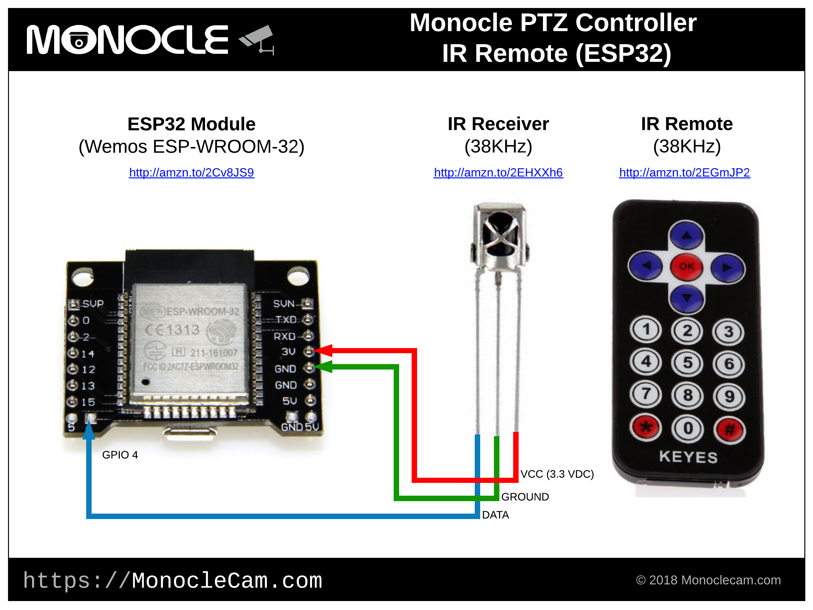

# Monocle IP Camera Arduino Library
This library works in conjunction with the MonocleCam cloud service to provide camera control and automation for ONVIF supported network/IP cameras.

PTZ (Pan, Tilt, Zoom) control, recalling presets and recalling the camera's home position are supported via a locally running Monocle Gateway service.  The Monocle Gateway service can communicate with the MonocleCam cloud services to obtain a listing of your configured cameras and subscribe to the current camera actively viewed by the Monocle Alexa Smart Home skill.

Sign up for a Monocle account at: https://MonocleCam.com

___

## Complete Article

___Read the complete article on this project at:___ ___https://www.hackster.io/monocle/monocle-view-control-ip-cameras-with-alexa-arduino-32bdd3___

___

## Version History
* 0.1 - Initial Release (2018-02-24)

## Library Dependencies

This library depends on:
* [ArduinoHttpClient](https://github.com/arduino-libraries/ArduinoHttpClient)

## Classes

This library provides the following classes:
 * [MonocleClientGateway](src/MonocleGatewayClient.h) - Client to Monocle Gateway Service
 * [MonoclePTZJoystick](src/MonoclePTZJoystick.h) - Joystick Implementation for 2 or 3 Axis Analog Input Joysticks
 * [MonocleMenu](src/MonocleMenu.h)  - Menu System for Monocle PTZ Controllers
 * [MonocleOLED](src/MonocleOLED.h) - OLED Wrapper for Monocle PTZ Controllers
 * [MonocleOLEDMenuRenderer.h](src/MonocleOLEDMenuRenderer.h) - OLED Menu Renderer for Monocle PTZ Controllers

## Sample Projects

The library includes the following Arduino sample PTZ controller projects:

* [Deluxe 3-Axis Joystick PTZ Controller](#deluxe)
* [Basic 2-Axis Joystick PTZ Controller](#basic)
* [Retro Gaming Joystick PTZ Controller](#retro)
* [IR Remote Control PTZ Controller](#irremote)

___

<a name="deluxe">
### Deluxe 3-Axis Joystick PTZ Controller

This project implements a 3-axis joystick controller with an Arduino MKR1000 to provide the most sophisticated and feature rich controller of all the project samples we provide. This project implements a small OLED module (128x64 pixels) to serve as a user interface for menu navigation. The third axis on this joystick is a rotational axis that is used for zoom control. All three axis on this joystick provide positional feedback (potentiometers) so we use this information to ramp PTZ movement speed proportionally with the position of the joystick relative to it's center.

#### Source Code
* [Monocle_PTZController_Deluxe_MKR1000](examples/Monocle_PTZController_Deluxe_MKR1000)

#### Project Dependencies

| Library       | Purpose     | URL  |
| ------------- |-------------| -----|
| ArduinoHttpClient      | used for web-socket communication | https://github.com/arduino-libraries/ArduinoHttpClient |
| Adafruit_GFX      | used for OLED display | https://github.com/adafruit/Adafruit-GFX-Library |
| Adafruit_SSD1306  | used for OLED display |  https://github.com/adafruit/Adafruit_SSD1306 |
| Arduino-MenuSystem  | used for menu navigation on OLED display | https://github.com/jonblack/arduino-menusystem |
| Bounce2  | used for debouncing the joystick button |  https://github.com/thomasfredericks/Bounce2 |

#### Bill Of Materials

| Qnty | Item        |  Buy     |
| ---- | ----------- |----------|
| 1 | Arduino MKR1000 (WiFI) | https://store.arduino.cc/usa/arduino-mkr1000 |
| 1 | Diymall 0.96" Inch Yellow Blue I2C Oled 128x64 for Arduino (128x64) |  http://amzn.to/2CvIJG8 |
| 1 | Uxcell 10K Momentary Pushbutton Switch Joystick Potentiometer | http://amzn.to/2BBTWrU |
| 1 | Hammond 1591TSBK Plastic Enclosure (Black) | http://amzn.to/2CA4812 |
| 1 | 10-wire Ribbon Cable (Hook up wire) | http://amzn.to/2ECzv0N |
| 1 | (*OPTIONAL*) Adafruit Lithium Ion Polymer Battery 3.7V 1200mAh | http://amzn.to/2EDDZV2 |
| 1 | (*OPTIONAL*) Micro USB Regulated Power Supply (5VDC 1A) | http://amzn.to/2HqFFyT |

#### Wiring Diagram:

___
<a name="basic">

### Basic 2-Axis Joystick PTZ Controller

This project implements a small 2-axis joystick controller with an Arduino MKR1000 to provide virtually the same features as the Deluxe version of this project but with a more compact form factor and without a direct means of zoom control. The project does support zoom, but you have to access it via the menu system first. (Note: you cannot perform the zoom and tilt functions simultaneously). This project implements a tiny OLED module (128x32 pixels) to serve as a user interface for menu navigation.

#### Source Code
* [Monocle_PTZController_Basic_MKR1000](examples/Monocle_PTZController_Basic_MKR1000)

#### Project Dependencies

| Library       | Purpose     | URL  |
| ------------- |-------------| -----|
| ArduinoHttpClient      | used for web-socket communication | https://github.com/arduino-libraries/ArduinoHttpClient |
| Adafruit_GFX      | used for OLED display | https://github.com/adafruit/Adafruit-GFX-Library |
| Adafruit_SSD1306  | used for OLED display |  https://github.com/adafruit/Adafruit_SSD1306 |
| Arduino-MenuSystem  | used for menu navigation on OLED display | https://github.com/jonblack/arduino-menusystem |
| Bounce2  | used for debouncing the joystick button |  https://github.com/thomasfredericks/Bounce2 |

#### Bill Of Materials

| Qnty | Item        |  Buy     |
| ---- | ----------- |----------|
| 1 | Arduino MKR1000 (WiFI) | https://store.arduino.cc/usa/arduino-mkr1000 |
| 1 | MakerFocus 2pcs I2C OLED Display Module 0.91 inch (128x32) |  http://amzn.to/2BBvqXX |
| 1 | Adafruit Analog 2-axis Thumb Joystick with Select Button | http://amzn.to/2HoXlea |
| 1 | Serpac A21 ABS Plastic Enclosure, 4-1/4" Length x 2.60" Width x 1-1/8" Height, Black | http://amzn.to/2EUcAgR |
| 1 | 10-wire Ribbon Cable (Hook up wire) | http://amzn.to/2ECzv0N |
| 1 | (*OPTIONAL*) Adafruit Lithium Ion Polymer Battery 3.7V 1200mAh | http://amzn.to/2EDDZV2 |
| 1 | (*OPTIONAL*) Micro USB Regulated Power Supply (5VDC 1A) | http://amzn.to/2HqFFyT |

#### Wiring Diagram:

___
<a name="retro">

### Retro Gaming Joystick PTZ Controller

Retro computing holds a special place in my heart so I thought it only fitting to build a PTZ controller based on a retro gaming joystick. This project uses an Atari / Commodore compatible joystick to control your cameras. This project is perhaps the simplest PTZ controller of all the sample projects to build and understand. It only makes use of simple digital inputs and the build can easily be housed in a small plastic enclosure for a very clean and minimalistic footprint.

This controller implementation is basic with no user interface but still supports the essential PTZ functions as follows.

* Joystick Up > Tilt Camera Up
* Joystick Down > Tilt Camera Down
* Joystick Left > Pan Camera Left
* Joystick Right > Pan Camera Right
* Joystick Up + Button Pressed > Zoom Camera In
* Joystick Down + Button Pressed > Zoom Camera Out
* Button Double Click > Restore Camera to Home Position

#### Source Code

We provide a number of examples of this project for various micro-controller boards including the Arduino MKR1000 board, an ESP8266 and ESP32 board.

* Arduino MKR1000 -  [Monocle_PTZController_AtariJoystick_MKR1000](examples/Monocle_PTZController_AtariJoystick_MKR1000)

* ESP8266 -  [Monocle_PTZController_AtariJoystick_ESP8266](examples/Monocle_PTZController_AtariJoystick_ESP8266)

* ESP32 -  [Monocle_PTZController_AtariJoystick_ESP32](examples/Monocle_PTZController_AtariJoystick_ESP32)

#### Project Dependencies

| Library       | Purpose     | URL  |
| ------------- |-------------| -----|
| ArduinoHttpClient      | used for web-socket communication | https://github.com/arduino-libraries/ArduinoHttpClient |
| Bounce2  | used for debouncing the joystick button |  https://github.com/thomasfredericks/Bounce2 |

#### Bill Of Materials

| Qnty | Item        |  Buy     |
| ---- | ----------- |----------|
| 1 | Makerfocus ESP32 Development Board Wemos Lolin for Arduino |  http://amzn.to/2EBFYsF |
| or 1 | Makerfocus D1 Mini NodeMcu 4M ESP8266 ESP-12F |  http://amzn.to/2FfOsDd |
| or 1 | Arduino MKR1000 (WiFI) | https://store.arduino.cc/usa/arduino-mkr1000 |
| 1 | DB9 Male Solder D-SUB Connector with Plastic Shell | http://amzn.to/2FeytF7 |
| 1 | 10-wire Ribbon Cable (Hook up wire) | http://amzn.to/2ECzv0N |
| 1 | CirKa "A77" Premium Joystick Controller for Atari 2600 (*OR ANY ATARI/COMMODORE COMPATIBLE JOYSTICK*) | http://amzn.to/2CvvN3j |
| 1 | 2.2"x1.4"x 0.6" Plastic Electric Project Case (5 pc) (__FOR ESP32 or ESP8266__) | http://amzn.to/2GxxyiS |
| 1 | Serpac A21 ABS Plastic Enclosure, 4-1/4" Length x 2.60" Width x 1-1/8" Height, Black (__FOR MKR1000__) | http://amzn.to/2EUcAgR |
| 1 | (*OPTIONAL*) Micro USB Regulated Power Supply (5VDC 1A) | http://amzn.to/2HqFFyT |

#### Wiring Diagram:

__Arduino MKR1000__

__ESP8266__

__ESP32__

___
<a name="irremote">

### IR Remote Control PTZ Controller

Some users will no doubt prefer a more discrete form of PTZ control without some joystick sitting on the coffee table or nightstand.  This project implements the PTZ controller in the form of a very compact infrared remote control.  This project is among the simplest PTZ controller in our sample projects.  In fact its the easiest one to build only requiring three pins connected from a tiny IR receiver to the micro-controller.  It can easily be housed in a small plastic enclosure for a very clean and minimalistic aesthetic and place in a discrete location.

The remote control implementation is basic with no user interface but supports all of the same PTZ functions as the deluxe controller project. The remote control functions as follows:

* [ LEFT ] - PAN LEFT (continuous while held down)
* [ RIGHT ] - PAN RIGHT (continuous while held down)
* [ UP ] - TILT UP (continuous while held down)
* [ DOWN ] - TILT DOWN (continuous while held down)
* [ * ] - ZOOM IN (continuous while held down)
* [ # ] - ZOOM OUT (continuous while held down)
* [ 0 ] - GOTO HOME POSITION
* [ 1 ] - RECALL PRESET 1
* [ 2 ] - RECALL PRESET 2
* [ 3 ] - RECALL PRESET 3
* [ 4 ] - RECALL PRESET 4
* [ 5 ] - RECALL PRESET 5
* [ 6 ] - RECALL PRESET 6
* [ 7 ] - RECALL PRESET 7
* [ 8 ] - RECALL PRESET 8
* [ 9 ] - RECALL PRESET 9

#### Source Code

We provide an example of this project for the Arduino MKR1000 board and the ESP32 board.
* Arduino MKR1000 -  [Monocle_PTZController_IRRemote_MKR1000](examples/Monocle_PTZController_IRRemote_MKR1000)

* ESP32 -   [Monocle_PTZController_IRRemote_ESP32](examples/Monocle_PTZController_IRRemote_ESP32)

#### Project Dependencies

| Library       | Purpose     | URL  |
| ------------- |-------------| -----|
| ArduinoHttpClient      | used for web-socket communication | https://github.com/arduino-libraries/ArduinoHttpClient |
| Arduino-IRremote  | used for debouncing the joystick button |  https://github.com/z3t0/Arduino-IRremote |

#### Bill Of Materials

| Qnty | Item        |  Buy     |
| ---- | ----------- |----------|
| 1  | Makerfocus ESP32 Development Board Wemos Lolin for Arduino |  http://amzn.to/2EBFYsF |
| or 1 | Arduino MKR1000 (WiFI) | https://store.arduino.cc/usa/arduino-mkr1000 |
| 1 | WINGONEER IR Wireless Remote Control Sensor Module Kit for Arduino |  http://amzn.to/2sDvXWv |
| 1 | AIRSUNNY 5 pairs Infrared Diode LED 38KHz IR Emission and Receiver | http://amzn.to/2BBQ5v6 |
| 1 | 2.2"x1.4"x 0.6" Plastic Electric Project Case (5 pc) (__FOR ESP32__) | http://amzn.to/2GxxyiS |
| 1 | Serpac A21 ABS Plastic Enclosure, 4-1/4" Length x 2.60" Width x 1-1/8" Height, Black (__FOR MKR1000__) | http://amzn.to/2EUcAgR |
| 1 | (*OPTIONAL*) Micro USB Regulated Power Supply (5VDC 1A) | http://amzn.to/2HqFFyT |

#### Wiring Diagram:

__Arduino MKR1000__

__ESP32__

